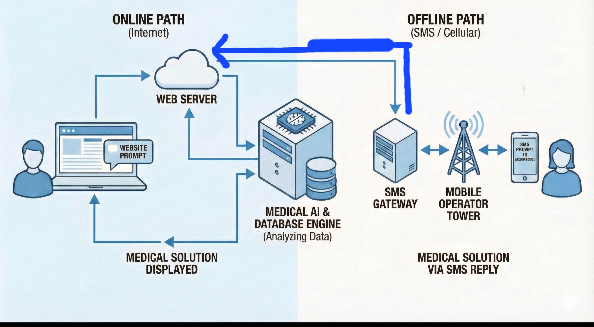

# FutureBuilders2025_NSU_TheAlchemist
Hackathon solution 

### Team member 
1. AL IMRAN
- 2212602642
- North South University 
- alimransonet18@gmail.com

2. Tanjid Haider
- 2232178043
- North South University 
- tanjidhaider2.0@gmail.com

3. Debobroto Sarkar Ankon
- 2233703643 
- North South University
- ankon01716@gmail.com

## Problem statement:
The Silent Struggle: Why Medical Support in Bangladesh's Hill Tracts and Rural Regions Remains Hard to Find

## Solution Overview
**ShasthyaSathi** is a lightweight healthcare support platform for Bangladesh’s **hill tracts and rural areas**, where doctors, pharmacies, and internet access are limited. It provides **AI doctor guidance** and **medicine ordering & delivery**, through both **Web** and **SMS**.

### Key Features
### 1) AI Doctor Care (Web + SMS)
Users describe symptoms in **Bangla** via website or SMS.  
Using **Perplexity AI**, the system returns:
- urgency level (Emergency / Urgent / Routine / Self-care)
- simple safe advice + danger signs

Web → full advice  
SMS → short prescription-style summary

### 2) Medicine Ordering + Delivery
Users order medicines via website or SMS (`MED ORS 3, Paracetamol 10`).  
Orders appear in an **Admin Dashboard** where volunteers/NGOs can:
- view orders
- assign delivery person
- update status (pending → delivered)

### 3) Offline SMS Support
An **Android phone acts as an SMS gateway**:
- receives SMS from users
- forwards to backend via Wi-Fi
- sends reply SMS back

### 4) Emergency Doctor Appoinment
- Since admin got full access to patient details ,admin can connect patient with doctor via Phone call
  
### Tech Stack
- Frontend: HTML + CSS + JavaScript  
- Backend: Node.js + Express  
- AI: Perplexity API  
- Storage: JSON (upgradeable)  
- SMS: Android gateway / future BD SMS gateway integration

## AI tools disclosure 
ChatGPT 
Perplexity 

## How we solve the solution handles limited internate access 

When we can't access internet we can send sms , and the sms will go to the backend and the information will feed to the sysytem for AI doctor Review . Then it will predict the disease and make a prescription. This prescription will send via SMS to the same number from which SMS has come . 

